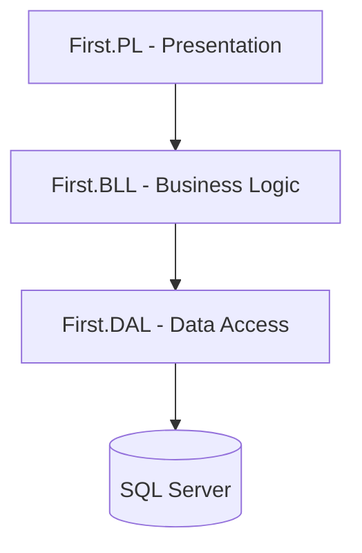

# First.MVC.PL


A classic ASP.NET Core MVC application demonstrating standard 3-Tier Architecture (Data Access Layer, Business Logic Layer, and Presentation Layer). The system features a robust department management demo powered by Entity Framework Core and SQL Server.

## 🏗️ Architecture



## 📂 Project Structure

| Tier | Project | Description |
|---|---|---|
| **Data Access Layer** | `First.DAL` | Entity Framework Core `AppDBContext`, `DepartmentRepository`, and database integrations. |
| **Business Logic Layer** | `First.BLL` | Core business services and rules mapping referencing the DAL. |
| **Presentation Layer** | `First.PL` | ASP.NET Core MVC host, `ControllersWithViews`, DI configuration, and UI. |

## 🚀 Getting Started

### Prerequisites
- [.NET 8 SDK](https://dotnet.microsoft.com/download/dotnet/8.0)
- SQL Server

### Installation & Execution

```bash
# 1. Clone the repository
git clone https://github.com/OmarAlfar0uk/First.MVC.PL.git

# 2. Navigate to the project root
cd First.MVC.PL

# 3. Restore dependencies
dotnet restore

# 4. Run the application
dotnet run --project First.PL
```

---

## 👨‍💻 Author

**Omar Alfarouk**
- GitHub: [OmarAlfar0uk](https://github.com/OmarAlfar0uk)
- LinkedIn: [omar-alfarouk-252471251](https://www.linkedin.com/in/omar-alfarouk-252471251/)
- Email: [omaralfarouk646@gmail.com](mailto:omaralfarouk646@gmail.com)
