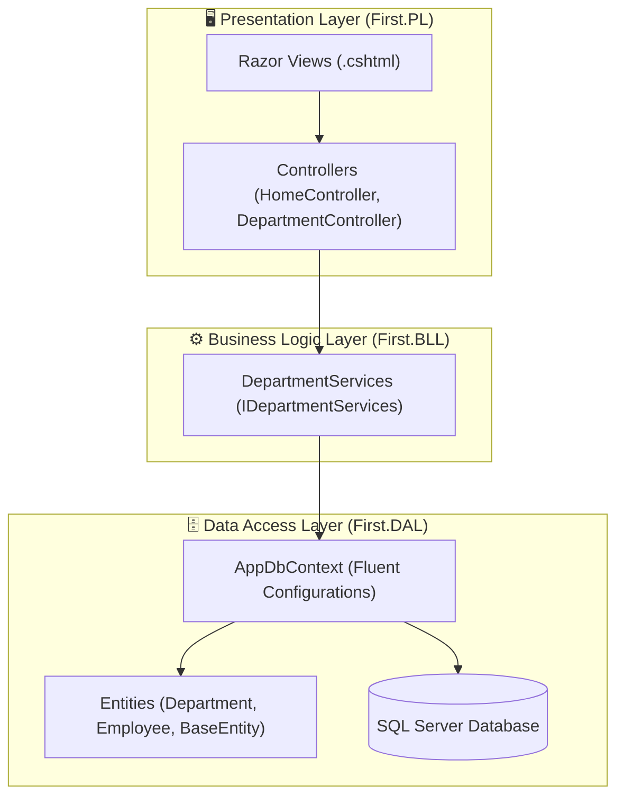

<div align="center">

# 🏛️ First.MVC.PL
### Enterprise 3-Tier ASP.NET Core MVC Application for Department & Human Resource Management

[](https://dotnet.microsoft.com/)
[](https://learn.microsoft.com/en-us/dotnet/csharp/)
[](#-system-architecture)
[](LICENSE)
[](https://github.com/OmarAlfar0uk)

<p align="center">
  <a href="#-key-features">Key Features</a> •
  <a href="#-system-architecture">System Architecture</a> •
  <a href="#-tech-stack">Tech Stack</a> •
  <a href="#-project-structure">Project Structure</a> •
  <a href="#-getting-started">Getting Started</a> •
  <a href="#-author">Author</a>
</p>

</div>

---

## 📌 Executive Overview

**First.MVC.PL** is a classic enterprise 3-tier ASP.NET Core MVC application developed to demonstrate architectural separation of concerns. It manages company departments, employee assignments, and organizational hierarchies using a decoupled layered architecture spanning **Presentation (PL)**, **Business Logic (BLL)**, and **Data Access (DAL)**.

> [!NOTE]
> Follows the **3-Tier Enterprise Architecture Pattern** with dedicated project boundaries: **First.PL** (Razor views & controllers), **First.BLL** (business rules & services), and **First.DAL** (Entity Framework Core configurations and models).

---

## ✨ Key Features

| ⚡ Feature | 💡 Description | 🛠 Engineering Detail |
|---|---|---|
| **🏢 Department Management** | CRUD operations, creation dates, and department codes | Managed via `DepartmentServices` and `IDepartmentServices` |
| **👥 Employee & Staff Hierarchy** | Staff assignment, salary tracking, and departmental associations | Relational foreign keys configured via Fluent API |
| **📐 3-Tier Layering** | Strict physical and logical boundary between UI, logic, and data | High cohesion and low coupling across projects |
| **🎨 Responsive UI** | Razor Views styled with modern CSS and Tag Helpers | User-friendly dashboard for administrative staff |

---

## 🏛 System Architecture



---

## ⚡ Tech Stack

| Category | Technology | Purpose |
|---|---|---|
| **Platform** |   | ASP.NET Core MVC runtime |
| **Architecture** |  | Presentation, BLL, and DAL project separation |
| **Data & ORM** |   | Relational persistence and schema management |
| **Frontend** |  | Server-side rendered responsive UI |

---

## 📂 Project Structure

```text
First.MVC.PL/
├── First.PL/                  # Presentation Layer: Controllers, Views, TagHelpers, Program.cs
├── First.BLL/                 # Business Logic Layer: Services & Business Validations
├── First.DAL/                 # Data Access Layer: Entities, DbContext & Configurations
└── First.sln                  # Visual Studio Solution
```

---

## 🚀 Getting Started

1. **Clone repository:**
   ```bash
   git clone https://github.com/OmarAlfar0uk/First.MVC.PL.git
   cd First.MVC.PL
   ```

2. **Launch Application:**
   ```bash
   dotnet run --project First.PL/First.PL.csproj
   ```

---

## 👨‍💻 Author

**Omar Alfarouk**  
*Full-Stack .NET & Software Engineer*  

- 🌐 **GitHub:** [@OmarAlfar0uk](https://github.com/OmarAlfar0uk)
- 💼 **LinkedIn:** [omar-alfarouk](https://www.linkedin.com/in/omar-alfarouk-252471251/)
- 📧 **Email:** [omaralfarouk646@gmail.com](mailto:omaralfarouk646@gmail.com)

---

<div align="center">
  <sub>Built with ❤️ by Omar Alfarouk. Licensed under the <a href="LICENSE">MIT License</a>.</sub>
</div>
